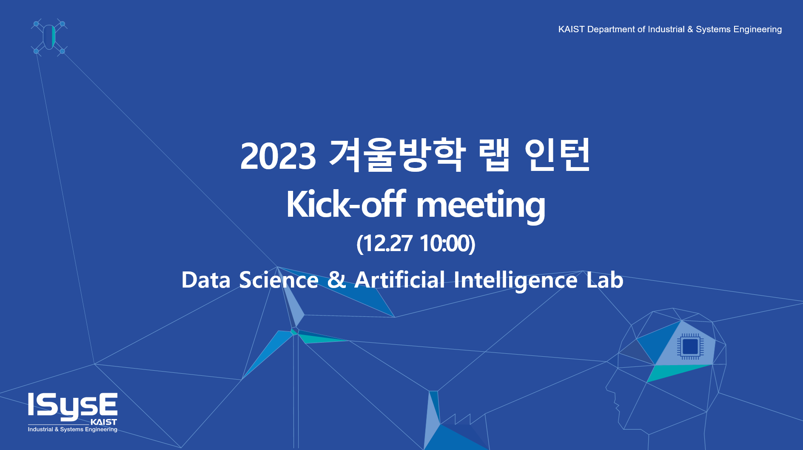

# 2023-winter-internship
 

## Data Science and Artificial Intelligence Laboratory (DSAIL)
- [Official Laboratory Homepage (Website)](http://dsail.kaist.ac.kr/)
- [Introduction to the laboratory (YouTube)](https://www.youtube.com/watch?v=3Nz19Kln-yE)
- [What we are interested in (Research PDF)](https://dsail.kaist.ac.kr/files/research.pdf)

## Tentative Schedule
### Basic recommender system and Graph Neural Network
| Year | Paper | Short | Presenter | slides |
| :---: | --- | --- | --- | --- |
| 2016 | [Semi-Supervised Classification with Graph Convolutional Networks](https://arxiv.org/abs/1609.02907)| GCN | 서지민 | [Slide](./slides/GCN.pdf) |
| 2014 | [DeepWalk: Online Learning of Social Representations](https://arxiv.org/abs/1403.6652)| Deepwalk | 김준영 | [Slide](./slides/Deepwalk.pdf) |
| 2008 | [Probabilistic Matrix Factorization](https://papers.nips.cc/paper/2007/file/d7322ed717dedf1eb4e6e52a37ea7bcd-Paper.pdf)| PMF | 이수찬 | [Slide](./slides/PMF.pdf) | 
| 2009 | [Matrix Factorization Techniques for Recommender Systems](https://datajobs.com/data-science-repo/Recommender-Systems-[Netflix].pdf)| Netflix | 이종근 | [Slide](./slides/Netflix.pdf) |
| 2008 | [Factorization Meets the Neighborhood: a Multifaceted Collaborative Filtering Model](https://dl.acm.org/doi/10.1145/1401890.1401944) | Netflix | 이종근 | [Slide](./slides/Netflix.pdf) |
| 2008 | [Collaborative Filtering for Implicit Feedback Datasets](http://yifanhu.net/PUB/cf.pdf)| OCCF | 윤민석 | [Slide](./slides/OCCF.pdf) |
| 2012 | [BPR: Bayesian Personalized Ranking from Implicit Feedback](https://arxiv.org/ftp/arxiv/papers/1205/1205.2618.pdf)| BPR | 이해준 | [Slide](./slides/BPR.pdf) |
| 2013 | [Translating Embeddings for Modeling Multi-relational Data](https://papers.nips.cc/paper/2013/hash/1cecc7a77928ca8133fa24680a88d2f9-Abstract.html)| TransE | 정승안 | [Slide](./slides/TransE.pdf) |
| 2017 | [Collaborative Metric Learning](https://www.cs.cornell.edu/~ylongqi/paper/HsiehYCLBE17.pdf)| CML | 한재민 | [Slide](./slides/CML.pdf) |
| 2010 | [Factorization Machines](https://www.csie.ntu.edu.tw/~b97053/paper/Rendle2010FM.pdf)| FM | 최은학 | [Slide](./slides/FM.pdf)|
| 2016 | [Wide & Deep Learning for Recommender Systems](https://arxiv.org/abs/1606.07792)| WD | 구본우 | [Slide](./slides/WD.pdf) |
| 2008 | [SoRec: Social Recommendation Using Probabilistic Matrix Factorization](https://dl.acm.org/doi/10.1145/1458082.1458205)| SoRec | 서지민 | [Slide](./slides/SoRec_Reg.pdf) |
| 2011 | [Recommender Systems with Social Regularization](https://dennyzhou.github.io/papers/RSR.pdf)| SoReg | 서지민 | [Slide](./slides/SoRec_Reg.pdf) |
| 2017 | [metapath2vec : Scalable Representation Learning for Heterogeneous Networks](https://dl.acm.org/doi/10.1145/3097983.3098036)| Metapath2Vec | 김준영 | [Slide](./slides/Metapath2Vec.pdf) | 
| 2018 | [Deep Graph Infomax](https://arxiv.org/abs/1809.10341)| DGI | 이종근 | [Slide](./slides/DGI.pdf) |
| 2017 | [Inductive Representation Learning on Large Graphs](https://papers.nips.cc/paper/2017/file/5dd9db5e033da9c6fb5ba83c7a7ebea9-Paper.pdf)| GraphSAGE | 이수찬 | [Slide](./slides/GraphSAGE.pdf) | 
| 2013 | [Auto-Encoding Variational Bayes](https://arxiv.org/abs/1312.6114)| VAE | 윤민석 | [Slide](./slides/VAE_VGAE.pdf) |
| 2016 | [Variational Graph Auto-Encoders](https://arxiv.org/abs/1611.07308)| VGAE | 윤민석 | [Slide](./slides/VAE_VGAE.pdf) |
| 2016 | [Deep Neural Networks for YouTube Recommendations](https://static.googleusercontent.com/media/research.google.com/ko//pubs/archive/45530.pdf)| Youtube | 이해준 | [Slide](./slides/Youtube.pdf) |
| 2015 | [AutoRec: Autoencoders Meet Collaborative Filtering](https://users.cecs.anu.edu.au/~akmenon/papers/autorec/autorec-paper.pdf)| Autorec | 정승안 | [Slide](./slides/ConvMF_Autorec.pdf) |
| 2015 | [Convolutional Matrix Factorization for Document Context-Aware Recommendation](https://dl.acm.org/doi/10.1145/2959100.2959165)| ConvMF | 정승안 | [Slide](./slides/ConvMF_Autorec.pdf) |
| 2023 | [Augmentation-Free Self-Supervised Learning on Graphs](https://arxiv.org/abs/2112.02472)| AFGRL | 한재민 | [Slide](./slides/AFGRL.pdf) |

### Participate to projects
- On-going projects
  - Universal User Representation 학습
  - 화학 물질간의 상호작용을 통한 물성 예측
  - 시각 메모리 기억을 위한 시각 지식 그래프 생성
  - Single-cell RNA sequencing
  - MATH AI (Multi-modal Reasoning)
- 담당 대학원생과 함께 진행

## Team Introduction (Lab Interns)  
### 서지민
* [Jimin Repository (N/A)](https://github.com/)

### 김준영
* [Junyoung Repository](https://github.com/Huchu111111/git_)

### 이수찬
* [Suchan Repository (N/A)](https://github.com/)  

### 이종근
* [Jongkeun Repository](https://github.com/OnMyWave/gnn-models)  

### 윤민석  
* [Minseok Repository](https://github.com/mminseok1/KAIST_DSAIL)  

### 이해준  
* [Haejoon Repository (N/A)](https://github.com/)    

### 정승안  
* [SeungAn Repository](https://github.com/junggernaut/2023-winter-internship-DSAIL)  

### 한재민  
* [Jaemin Repository (N/A)](https://github.com/)  

### 최은학
* [Eunhak Repository (N/A)](https://github.com/)

### 구본우
* [Bonwoo Repository](https://github.com/kbw8258/2024-DSAIL-Lab-Intern)